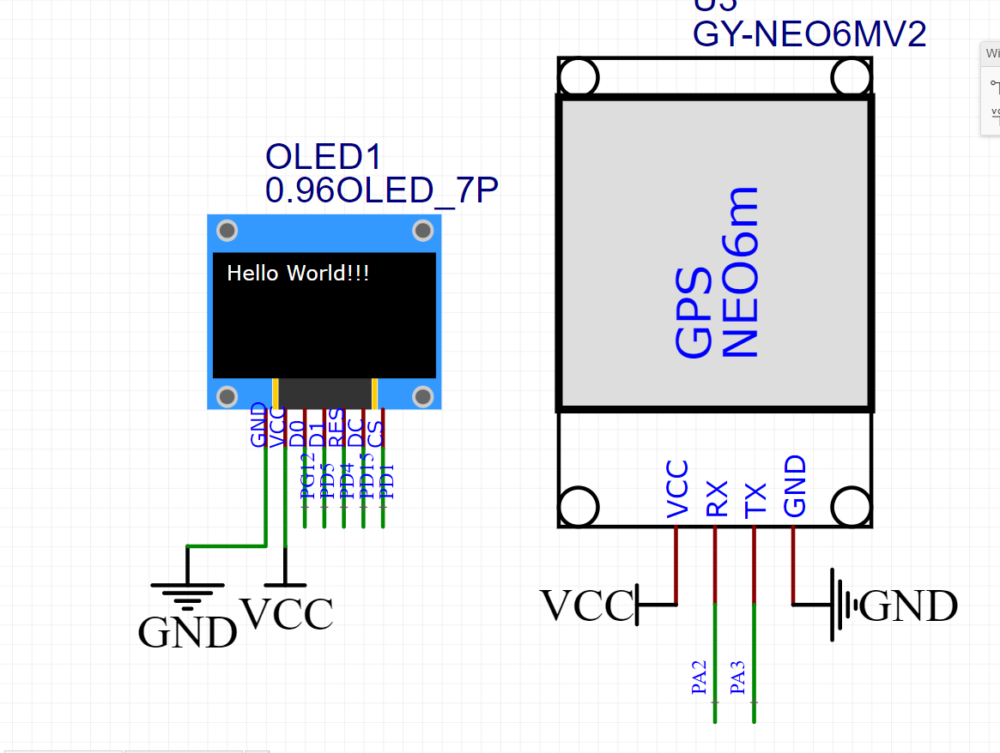

<!--
 * @Description: 
 * @Version: 1.0
 * @Autor: shuai
 * @Date: 2020-05-16 18:13:02
 * @LastEditTime: 2020-05-27 11:20:11
--> 

# GPS-based-on-stm32f103zet6

this program about GPS is developed on stm32f103zet6,it will show utc time,longitude,latitude,direction etc on OLED screen(128*64)

基本功能已完成,能够显示经度,纬度,海拔高度和时间

我使用了stm32f103zet6的微控制器,GPS模块是GY-NEO6MV2,OLED屏幕和MCU之间模拟SPI通信
模块的连接如图:

